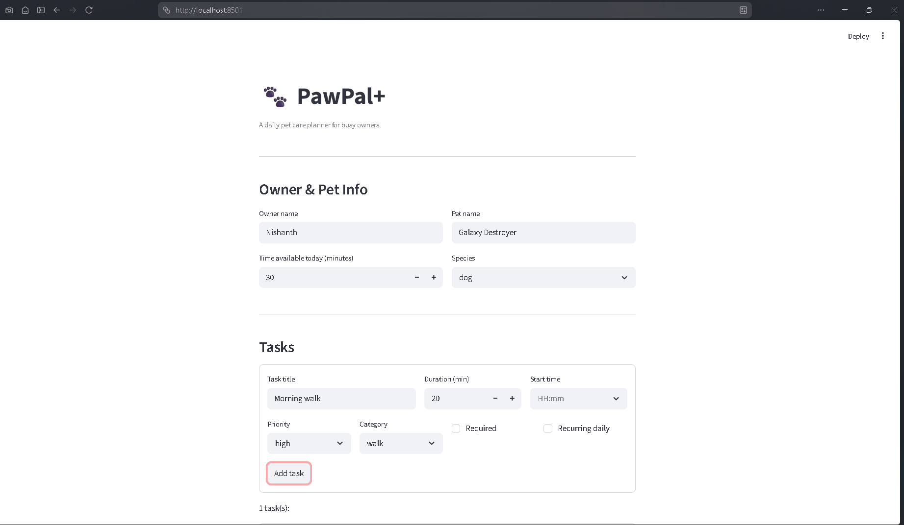
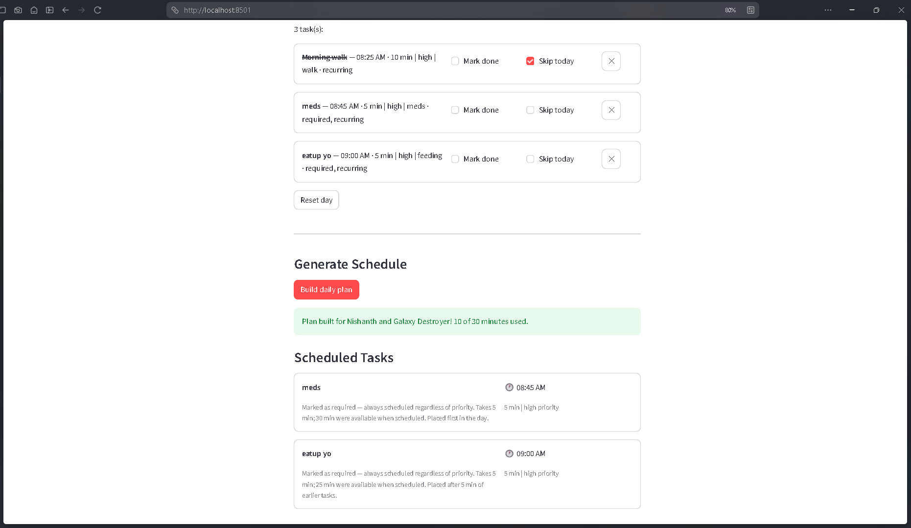

# PawPal+

A daily pet care planning app built with Python and Streamlit. PawPal+ helps busy pet owners stay consistent with pet care by generating a prioritized, time-aware schedule for the day — and explaining every decision it makes.

---

## Features

- **Owner & pet setup** — enter your name, pet name, species, and daily time budget
- **Task management** — add, remove, and track care tasks with title, duration, priority, category, start time, and recurrence
- **Smart scheduling** — tasks are sorted by desired start time and priority; required tasks are always placed first; overlapping tasks are shifted forward automatically
- **Daily state tracking** — mark tasks as done or skip recurring tasks for today; reset everything for the next day
- **Transparent reasoning** — every scheduled task includes an explanation of why it was chosen and when

---

## Project Structure

```text
pawpal_system.py   # Core logic: Task, Pet, Owner, Scheduler, Plan
app.py             # Streamlit UI
tests/
  test_pawpal.py   # 23 pytest tests covering scheduling, state, and filtering
requirements.txt
reflection.md
```

---

## Setup

```bash
python -m venv .venv

# Mac/Linux
source .venv/bin/activate

# Windows
.venv\Scripts\activate

pip install -r requirements.txt
```

---

## Running the App

```bash
streamlit run app.py
```

---

## Running Tests

```bash
pytest tests/
```

---

## How It Works

### Scheduling Algorithm

1. Tasks marked `completed` or `skipped_today` are excluded before scheduling begins.
2. Remaining tasks are sorted by:
   - Desired start time (earliest first)
   - Required status (required tasks win ties)
   - Priority (`high > medium > low`)
   - Duration (shorter tasks break further ties)
3. Tasks are greedily accepted if they fit within the owner's `available_minutes` budget.
4. If a task's desired start time overlaps with the end of the previous task, its actual start is shifted forward.
5. Each accepted task gets a plain-English explanation of why it was scheduled.

### Class Overview

| Class | Responsibility |
| --- | --- |
| `Task` | Holds task data and daily state (`completed`, `skipped_today`) |
| `Pet` | Stores pet name and species |
| `Owner` | Manages the task list and time budget; provides `mark_complete`, `skip_today`, `reset_day`, `filter_tasks` |
| `Scheduler` | Sorts and schedules tasks into a `Plan` |
| `ScheduledTask` | A task with an assigned actual start time and reason |
| `Plan` | Output: scheduled tasks, skipped tasks, total time used |

---

## Screenshots

<!-- Add screenshots here. Suggested shots:
     1. Owner & pet setup + task list with a few tasks added
     2. Generated schedule showing scheduled tasks with reasons and skipped tasks
-->

| Task List | Generated Schedule |
| --- | --- |
|  |  |

---

## Tech Stack

- [Python 3.12](https://www.python.org/)
- [Streamlit](https://streamlit.io/)
- [pytest](https://pytest.org/)
